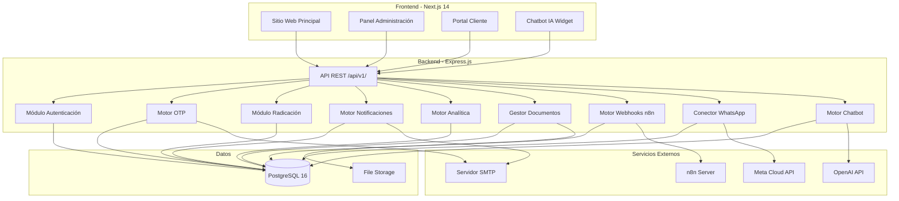
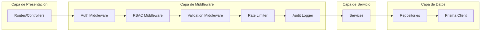
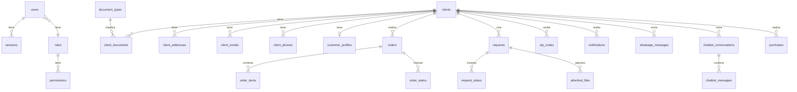

# Documento de Diseño Técnico — UrbanThread AI

## Descripción General (Overview)

UrbanThread AI es una plataforma Smart Commerce empresarial de pila completa que digitaliza y automatiza las operaciones de retail de "La moda es vida". La plataforma integra un sitio web público de alto impacto visual, un panel de administración completo, un portal de clientes con autenticación OTP, un chatbot con IA, integración con WhatsApp Business, automatización de flujos con n8n, un módulo de radicación de 12 pasos, analítica en tiempo real, gestión documental y un sistema de notificaciones.

### Objetivos del Sistema

- Proveer una experiencia de usuario premium alineada con la identidad de marca UrbanThread AI
- Automatizar flujos operativos mediante integración con n8n y WhatsApp Business API
- Garantizar trazabilidad completa de todas las operaciones mediante auditoría y logging
- Implementar seguridad robusta con JWT, OTP, RBAC, cifrado y rate limiting
- Soportar presentación EXPOPROYECTOS con datos simulados realistas

### Stack Tecnológico

| Capa | Tecnología |
|------|-----------|
| Frontend | React 18 + Next.js 14 (App Router) |
| Estilos | Tailwind CSS + componentes personalizados |
| Estado | Zustand (global) + React Query (servidor) |
| Backend | Node.js 20 + Express.js |
| Base de Datos | PostgreSQL 16 |
| ORM | Prisma |
| Autenticación | JWT + OTP por email |
| Validación | Zod (frontend y backend) |
| Email | Nodemailer + plantillas HTML |
| Chatbot IA | OpenAI API (GPT-4) |
| Automatización | n8n (webhooks) |
| WhatsApp | Meta Cloud API / WhatsApp Business API |
| Testing | Vitest + fast-check (PBT) |
| Documentación API | Swagger / OpenAPI 3.0 |

## Arquitectura

### Arquitectura General del Sistema



### Arquitectura de Capas del Backend



### Decisiones de Arquitectura

1. **Monorepo con separación frontend/backend**: Se utiliza una estructura monorepo con carpetas `frontend/` y `backend/` separadas para facilitar el desarrollo y despliegue independiente, manteniendo tipos compartidos en `shared/`.

2. **Next.js App Router**: Se elige App Router sobre Pages Router por su soporte nativo de Server Components, layouts anidados y streaming, optimizando el rendimiento de carga.

3. **Prisma como ORM**: Prisma provee type-safety completo, migraciones declarativas y un cliente generado que reduce errores en tiempo de ejecución.

4. **Zustand + React Query**: Zustand para estado de UI global (tema, sidebar, modales) y React Query para estado del servidor (caché, revalidación, optimistic updates).

5. **Zod para validación compartida**: Los esquemas Zod se definen en `shared/` y se reutilizan en frontend y backend, garantizando consistencia en la validación.

6. **Arquitectura de servicios en backend**: Patrón Controller → Service → Repository para separación de responsabilidades y testabilidad.

### Estructura del Proyecto

```
urbanthread-ai/
├── frontend/
│   ├── src/
│   │   ├── app/                    # Next.js App Router
│   │   │   ├── (public)/           # Rutas públicas
│   │   │   │   ├── page.tsx        # Página de inicio
│   │   │   │   ├── servicios/
│   │   │   │   ├── contacto/
│   │   │   │   └── testimonios/
│   │   │   ├── (auth)/             # Rutas de autenticación
│   │   │   │   ├── admin/login/
│   │   │   │   └── cliente/login/
│   │   │   ├── admin/              # Panel de administración
│   │   │   │   ├── layout.tsx
│   │   │   │   ├── dashboard/
│   │   │   │   ├── usuarios/
│   │   │   │   ├── clientes/
│   │   │   │   ├── pedidos/
│   │   │   │   ├── solicitudes/
│   │   │   │   ├── documentos/
│   │   │   │   ├── testimonios/
│   │   │   │   ├── analitica/
│   │   │   │   ├── chatbot/
│   │   │   │   ├── integraciones/
│   │   │   │   ├── auditoria/
│   │   │   │   └── configuracion/
│   │   │   ├── portal/             # Portal de cliente
│   │   │   │   ├── layout.tsx
│   │   │   │   ├── perfil/
│   │   │   │   ├── pedidos/
│   │   │   │   ├── solicitudes/
│   │   │   │   ├── documentos/
│   │   │   │   ├── radicacion/
│   │   │   │   └── notificaciones/
│   │   │   ├── not-found.tsx       # Página 404
│   │   │   ├── layout.tsx          # Layout raíz
│   │   │   └── globals.css
│   │   ├── components/
│   │   │   ├── ui/                 # Componentes base (Button, Input, Card, etc.)
│   │   │   ├── layout/            # Header, Footer, Sidebar, Breadcrumbs
│   │   │   ├── home/              # Secciones de la página de inicio
│   │   │   ├── admin/             # Componentes del panel admin
│   │   │   ├── portal/            # Componentes del portal cliente
│   │   │   ├── chatbot/           # Widget del chatbot
│   │   │   ├── radicacion/        # Stepper y pasos de radicación
│   │   │   ├── analitica/         # Gráficos y dashboards
│   │   │   └── shared/            # Componentes compartidos
│   │   ├── hooks/                 # Custom hooks
│   │   ├── stores/                # Zustand stores
│   │   ├── lib/                   # Utilidades, API client, constantes
│   │   └── types/                 # Tipos TypeScript del frontend
│   ├── public/                    # Assets estáticos
│   ├── next.config.js
│   ├── tailwind.config.ts
│   ├── tsconfig.json
│   └── package.json
├── backend/
│   ├── src/
│   │   ├── controllers/           # Controladores por dominio
│   │   ├── services/              # Lógica de negocio
│   │   ├── repositories/          # Acceso a datos
│   │   ├── middleware/            # Auth, RBAC, validation, rate-limit, audit
│   │   ├── routes/                # Definición de rutas
│   │   ├── validators/            # Esquemas Zod por endpoint
│   │   ├── utils/                 # Utilidades (email, crypto, tokens)
│   │   ├── integrations/          # WhatsApp, n8n, OpenAI
│   │   ├── config/                # Configuración de la app
│   │   ├── types/                 # Tipos TypeScript del backend
│   │   ├── seeds/                 # Datos semilla y simulados
│   │   └── app.ts                 # Entry point Express
│   ├── prisma/
│   │   ├── schema.prisma          # Esquema de base de datos
│   │   └── migrations/
│   ├── tests/
│   │   ├── unit/
│   │   ├── integration/
│   │   └── property/              # Tests de propiedades (fast-check)
│   ├── tsconfig.json
│   └── package.json
├── shared/
│   ├── schemas/                   # Esquemas Zod compartidos
│   ├── types/                     # Tipos compartidos
│   ├── constants/                 # Constantes compartidas
│   └── utils/                     # Utilidades compartidas
├── package.json                   # Workspace root
└── README.md
```


## Componentes e Interfaces

### Componentes del Frontend

#### 1. Sistema de Diseño (Design System)

**Paleta de Colores:**

| Token | Valor | Uso |
|-------|-------|-----|
| `--ut-primary` | `#0A1628` | Fondo principal oscuro, headers |
| `--ut-primary-light` | `#1A2A4A` | Fondos secundarios, cards |
| `--ut-accent` | `#00D4AA` | CTAs, enlaces activos, badges de éxito |
| `--ut-accent-hover` | `#00B894` | Hover de elementos accent |
| `--ut-gold` | `#F0C040` | Destacados premium, estrellas, badges |
| `--ut-electric` | `#6C5CE7` | Elementos de IA, chatbot, gradientes |
| `--ut-surface` | `#F8FAFB` | Fondos claros, áreas de contenido |
| `--ut-surface-dark` | `#E8ECF0` | Bordes, separadores |
| `--ut-text` | `#1A1A2E` | Texto principal |
| `--ut-text-muted` | `#6B7280` | Texto secundario |
| `--ut-danger` | `#EF4444` | Errores, alertas críticas |
| `--ut-warning` | `#F59E0B` | Advertencias |
| `--ut-success` | `#10B981` | Éxito, confirmaciones |
| `--ut-info` | `#3B82F6` | Información, tooltips |

**Tipografía:**

| Nivel | Fuente | Peso | Tamaño | Uso |
|-------|--------|------|--------|-----|
| H1 | Inter | 800 | 3rem / 48px | Títulos hero |
| H2 | Inter | 700 | 2.25rem / 36px | Títulos de sección |
| H3 | Inter | 600 | 1.5rem / 24px | Subtítulos |
| H4 | Inter | 600 | 1.25rem / 20px | Títulos de card |
| Body | Inter | 400 | 1rem / 16px | Texto general |
| Small | Inter | 400 | 0.875rem / 14px | Labels, captions |
| Code | JetBrains Mono | 400 | 0.875rem / 14px | Código, IDs |

**Componentes UI Base:**

```typescript
// Interfaz base para todos los componentes UI
interface UIComponentProps {
  className?: string;
  children?: React.ReactNode;
}

// Button
interface ButtonProps extends UIComponentProps {
  variant: 'primary' | 'secondary' | 'outline' | 'ghost' | 'danger';
  size: 'sm' | 'md' | 'lg';
  loading?: boolean;
  disabled?: boolean;
  icon?: React.ReactNode;
  onClick?: () => void;
}

// Card
interface CardProps extends UIComponentProps {
  variant: 'default' | 'elevated' | 'glass' | 'gradient';
  padding?: 'sm' | 'md' | 'lg';
  hover?: boolean;
}

// Input
interface InputProps {
  label: string;
  type: 'text' | 'email' | 'password' | 'number' | 'tel';
  placeholder?: string;
  error?: string;
  required?: boolean;
  disabled?: boolean;
  value: string;
  onChange: (value: string) => void;
}

// Modal
interface ModalProps extends UIComponentProps {
  isOpen: boolean;
  onClose: () => void;
  title: string;
  size: 'sm' | 'md' | 'lg' | 'xl';
}

// DataTable
interface DataTableProps<T> {
  columns: ColumnDef<T>[];
  data: T[];
  pagination?: boolean;
  pageSize?: number;
  searchable?: boolean;
  sortable?: boolean;
  onRowClick?: (row: T) => void;
  loading?: boolean;
}

// StatsCard (para dashboards)
interface StatsCardProps {
  title: string;
  value: string | number;
  change?: number;        // porcentaje de cambio
  changeLabel?: string;
  icon: React.ReactNode;
  trend?: 'up' | 'down' | 'neutral';
}
```

#### 2. Componentes de Layout

```typescript
// Header principal con navegación
interface HeaderProps {
  variant: 'public' | 'admin' | 'portal';
  user?: UserSession;
  notifications?: number;
}

// Sidebar para admin y portal
interface SidebarProps {
  items: SidebarItem[];
  collapsed?: boolean;
  onToggle: () => void;
}

interface SidebarItem {
  label: string;
  icon: React.ReactNode;
  href: string;
  badge?: number;
  children?: SidebarItem[];
  requiredPermission?: string;
}

// Breadcrumbs
interface BreadcrumbsProps {
  items: { label: string; href?: string }[];
}
```

#### 3. Widget del Chatbot IA

```typescript
interface ChatbotWidgetProps {
  position: 'bottom-right' | 'bottom-left';
  initialMessage?: string;
}

interface ChatMessage {
  id: string;
  role: 'user' | 'assistant' | 'system';
  content: string;
  timestamp: Date;
  metadata?: {
    escalated?: boolean;
    ticketId?: string;
  };
}

interface ChatbotState {
  isOpen: boolean;
  messages: ChatMessage[];
  conversationId: string | null;
  isTyping: boolean;
  toggle: () => void;
  sendMessage: (content: string) => Promise<void>;
  clearConversation: () => void;
}
```

#### 4. Componente Stepper de Radicación

```typescript
interface RadicacionStepperProps {
  currentStep: number;
  totalSteps: 12;
  onStepComplete: (stepData: StepData) => void;
  onBack: () => void;
}

interface StepData {
  step: number;
  data: Record<string, unknown>;
  isValid: boolean;
}

// Los 12 pasos del flujo
type RadicacionStep =
  | 'seleccion-tipo-documento'
  | 'ingreso-numero-documento'
  | 'consulta-base-datos'
  | 'carga-informacion-cliente'
  | 'autocompletado-campos'
  | 'adjuncion-documentos-asociados'
  | 'carga-nuevos-archivos'
  | 'registro-solicitud'
  | 'generacion-numero-radicacion'
  | 'envio-confirmacion-email'
  | 'disparo-flujo-n8n'
  | 'habilitacion-seguimiento';
```

### Interfaces del Backend

#### 1. Controladores (Controllers)

```typescript
// Estructura base de respuesta API
interface ApiResponse<T> {
  status: 'success' | 'error';
  data?: T;
  errors?: ApiError[];
  meta?: {
    page?: number;
    pageSize?: number;
    total?: number;
    totalPages?: number;
  };
}

interface ApiError {
  field?: string;
  message: string;
  code: string;
}

// Controlador de Autenticación
interface AuthController {
  loginAdmin(req: LoginRequest): Promise<ApiResponse<{ token: string; user: AdminUser }>>;
  refreshToken(req: RefreshRequest): Promise<ApiResponse<{ token: string }>>;
  logout(req: AuthenticatedRequest): Promise<ApiResponse<void>>;
}

// Controlador OTP
interface OTPController {
  requestOTP(req: OTPRequest): Promise<ApiResponse<{ message: string; expiresIn: number }>>;
  verifyOTP(req: OTPVerifyRequest): Promise<ApiResponse<{ token: string; client: ClientProfile }>>;
  resendOTP(req: OTPResendRequest): Promise<ApiResponse<{ message: string }>>;
}

// Controlador de Clientes
interface ClientController {
  getAll(req: PaginatedRequest): Promise<ApiResponse<Client[]>>;
  getById(id: string): Promise<ApiResponse<ClientDetail>>;
  getByDocument(type: string, number: string): Promise<ApiResponse<ClientDetail>>;
  create(req: CreateClientRequest): Promise<ApiResponse<Client>>;
  update(id: string, req: UpdateClientRequest): Promise<ApiResponse<Client>>;
  delete(id: string): Promise<ApiResponse<void>>;
}

// Controlador de Pedidos
interface OrderController {
  getAll(req: PaginatedRequest): Promise<ApiResponse<Order[]>>;
  getById(id: string): Promise<ApiResponse<OrderDetail>>;
  getByClient(clientId: string): Promise<ApiResponse<Order[]>>;
  create(req: CreateOrderRequest): Promise<ApiResponse<Order>>;
  updateStatus(id: string, req: UpdateStatusRequest): Promise<ApiResponse<Order>>;
}

// Controlador de Solicitudes / Radicación
interface RequestController {
  getAll(req: PaginatedRequest): Promise<ApiResponse<RequestRecord[]>>;
  getById(id: string): Promise<ApiResponse<RequestDetail>>;
  getByRadicationNumber(number: string): Promise<ApiResponse<RequestDetail>>;
  create(req: CreateRequestPayload): Promise<ApiResponse<RequestRecord>>;
  updateStatus(id: string, req: UpdateStatusRequest): Promise<ApiResponse<RequestRecord>>;
}

// Controlador de Documentos
interface DocumentController {
  upload(req: UploadRequest): Promise<ApiResponse<DocumentRecord>>;
  download(id: string): Promise<FileStream>;
  getByClient(clientId: string): Promise<ApiResponse<DocumentRecord[]>>;
  delete(id: string): Promise<ApiResponse<void>>;
}

// Controlador de Chatbot
interface ChatbotController {
  sendMessage(req: ChatMessageRequest): Promise<ApiResponse<ChatbotResponse>>;
  getConversation(id: string): Promise<ApiResponse<Conversation>>;
  getConversations(req: PaginatedRequest): Promise<ApiResponse<Conversation[]>>;
  escalate(conversationId: string): Promise<ApiResponse<{ ticketId: string }>>;
}

// Controlador de Analítica
interface AnalyticsController {
  getDashboard(req: DashboardRequest): Promise<ApiResponse<DashboardData>>;
  trackEvent(req: TrackEventRequest): Promise<ApiResponse<void>>;
  getMetrics(req: MetricsRequest): Promise<ApiResponse<MetricsData>>;
}

// Controlador de Notificaciones
interface NotificationController {
  getByUser(userId: string): Promise<ApiResponse<Notification[]>>;
  getUnreadCount(userId: string): Promise<ApiResponse<{ count: number }>>;
  markAsRead(id: string): Promise<ApiResponse<void>>;
  markAllAsRead(userId: string): Promise<ApiResponse<void>>;
}

// Controlador de Testimonios
interface TestimonialController {
  getAll(req: PaginatedRequest): Promise<ApiResponse<Testimonial[]>>;
  getPublic(): Promise<ApiResponse<Testimonial[]>>;
  create(req: CreateTestimonialRequest): Promise<ApiResponse<Testimonial>>;
  update(id: string, req: UpdateTestimonialRequest): Promise<ApiResponse<Testimonial>>;
  delete(id: string): Promise<ApiResponse<void>>;
}

// Controlador de Webhooks n8n
interface WebhookController {
  triggerEvent(req: WebhookEventRequest): Promise<ApiResponse<{ eventId: string }>>;
  getEventStatus(eventId: string): Promise<ApiResponse<WebhookEventStatus>>;
  retryEvent(eventId: string): Promise<ApiResponse<void>>;
}

// Controlador de WhatsApp
interface WhatsAppController {
  receiveMessage(req: WhatsAppWebhookPayload): Promise<void>;
  sendMessage(req: SendWhatsAppRequest): Promise<ApiResponse<{ messageId: string }>>;
  getConversations(req: PaginatedRequest): Promise<ApiResponse<WhatsAppConversation[]>>;
}
```

#### 2. Servicios (Services)

```typescript
// Servicio de Autenticación
interface AuthService {
  authenticateAdmin(email: string, password: string): Promise<AuthResult>;
  generateToken(user: AdminUser): string;
  verifyToken(token: string): TokenPayload;
  refreshToken(token: string): string;
  revokeToken(token: string): Promise<void>;
}

// Servicio OTP
interface OTPService {
  generateOTP(clientId: string): Promise<OTPRecord>;
  sendOTP(email: string, code: string): Promise<void>;
  verifyOTP(clientId: string, code: string): Promise<boolean>;
  isBlocked(clientId: string): Promise<boolean>;
  recordFailedAttempt(clientId: string): Promise<number>;
  resetAttempts(clientId: string): Promise<void>;
}

// Servicio de Radicación
interface RadicacionService {
  lookupClient(documentType: string, documentNumber: string): Promise<ClientDetail | null>;
  createRequest(data: CreateRequestPayload): Promise<RequestRecord>;
  generateRadicationNumber(): string;
  sendConfirmationEmail(request: RequestRecord): Promise<void>;
  triggerN8nWorkflow(request: RequestRecord): Promise<void>;
  getRequestStatus(radicationNumber: string): Promise<RequestStatus[]>;
}

// Servicio de Webhooks n8n
interface N8nWebhookService {
  sendWebhook(event: WebhookEvent): Promise<WebhookDeliveryResult>;
  retryWebhook(eventId: string, attempt: number): Promise<WebhookDeliveryResult>;
  scheduleRetry(eventId: string, attempt: number): void;
  validateIdempotencyKey(key: string): Promise<boolean>;
}

// Servicio de Documentos
interface DocumentService {
  upload(file: UploadedFile, clientId: string, metadata: DocumentMetadata): Promise<DocumentRecord>;
  download(documentId: string, requestingUserId: string): Promise<FileStream>;
  validateFile(file: UploadedFile): ValidationResult;
  deleteDocument(documentId: string): Promise<void>;
}

// Servicio de Analítica
interface AnalyticsService {
  trackEvent(event: AnalyticsEvent): Promise<void>;
  getDashboardData(filters: DashboardFilters): Promise<DashboardData>;
  getMetrics(filters: MetricsFilters): Promise<MetricsData>;
  generateSimulatedData(): Promise<void>;
}

// Servicio de Auditoría
interface AuditService {
  log(entry: AuditEntry): Promise<void>;
  getAuditLogs(filters: AuditFilters): Promise<AuditLog[]>;
}

interface AuditEntry {
  userId: string;
  action: string;
  resource: string;
  resourceId: string;
  timestamp: Date;
  ipAddress: string;
  result: 'success' | 'failure';
  details?: Record<string, unknown>;
}
```

### Especificación Completa de la API REST

Todos los endpoints están bajo el prefijo `/api/v1/`.

#### Autenticación y OTP

| Método | Ruta | Descripción | Auth |
|--------|------|-------------|------|
| POST | `/auth/admin/login` | Login de administrador | No |
| POST | `/auth/admin/refresh` | Refrescar token JWT | JWT |
| POST | `/auth/admin/logout` | Cerrar sesión admin | JWT |
| POST | `/auth/otp/request` | Solicitar código OTP | No |
| POST | `/auth/otp/verify` | Verificar código OTP | No |
| POST | `/auth/otp/resend` | Reenviar código OTP | No |

#### Usuarios y Roles

| Método | Ruta | Descripción | Auth |
|--------|------|-------------|------|
| GET | `/users` | Listar usuarios | JWT + RBAC |
| GET | `/users/:id` | Obtener usuario | JWT + RBAC |
| POST | `/users` | Crear usuario | JWT + RBAC |
| PUT | `/users/:id` | Actualizar usuario | JWT + RBAC |
| DELETE | `/users/:id` | Eliminar usuario | JWT + RBAC |
| GET | `/roles` | Listar roles | JWT + RBAC |
| POST | `/roles` | Crear rol | JWT + RBAC |
| PUT | `/roles/:id` | Actualizar rol | JWT + RBAC |
| GET | `/permissions` | Listar permisos | JWT + RBAC |

#### Clientes

| Método | Ruta | Descripción | Auth |
|--------|------|-------------|------|
| GET | `/clients` | Listar clientes (paginado) | JWT + RBAC |
| GET | `/clients/:id` | Detalle de cliente | JWT + RBAC |
| GET | `/clients/document/:type/:number` | Buscar por documento | JWT |
| POST | `/clients` | Crear cliente | JWT + RBAC |
| PUT | `/clients/:id` | Actualizar cliente | JWT + RBAC |
| DELETE | `/clients/:id` | Eliminar cliente | JWT + RBAC |
| GET | `/clients/:id/addresses` | Direcciones del cliente | JWT |
| POST | `/clients/:id/addresses` | Agregar dirección | JWT |
| GET | `/clients/:id/documents` | Documentos del cliente | JWT |
| GET | `/clients/:id/orders` | Pedidos del cliente | JWT |
| GET | `/clients/:id/requests` | Solicitudes del cliente | JWT |

#### Pedidos

| Método | Ruta | Descripción | Auth |
|--------|------|-------------|------|
| GET | `/orders` | Listar pedidos (paginado) | JWT + RBAC |
| GET | `/orders/:id` | Detalle de pedido | JWT |
| POST | `/orders` | Crear pedido | JWT |
| PUT | `/orders/:id/status` | Cambiar estado | JWT + RBAC |
| GET | `/orders/:id/history` | Historial de estados | JWT |
| GET | `/orders/:id/items` | Items del pedido | JWT |

#### Solicitudes / Radicación

| Método | Ruta | Descripción | Auth |
|--------|------|-------------|------|
| GET | `/requests` | Listar solicitudes (paginado) | JWT + RBAC |
| GET | `/requests/:id` | Detalle de solicitud | JWT |
| GET | `/requests/radication/:number` | Buscar por radicación | JWT |
| POST | `/requests` | Crear solicitud (radicación) | JWT |
| PUT | `/requests/:id/status` | Cambiar estado | JWT + RBAC |
| GET | `/requests/:id/history` | Historial de estados | JWT |
| GET | `/requests/:id/files` | Archivos adjuntos | JWT |

#### Documentos

| Método | Ruta | Descripción | Auth |
|--------|------|-------------|------|
| POST | `/documents/upload` | Cargar documento | JWT |
| GET | `/documents/:id/download` | Descargar documento | JWT |
| GET | `/documents/:id` | Metadatos del documento | JWT |
| DELETE | `/documents/:id` | Eliminar documento | JWT + RBAC |

#### Chatbot IA

| Método | Ruta | Descripción | Auth |
|--------|------|-------------|------|
| POST | `/chatbot/message` | Enviar mensaje | Opcional |
| GET | `/chatbot/conversations` | Listar conversaciones | JWT + RBAC |
| GET | `/chatbot/conversations/:id` | Detalle conversación | JWT |
| POST | `/chatbot/conversations/:id/escalate` | Escalar a agente | JWT |

#### WhatsApp

| Método | Ruta | Descripción | Auth |
|--------|------|-------------|------|
| POST | `/whatsapp/webhook` | Recibir mensaje (Meta) | Webhook Token |
| GET | `/whatsapp/webhook` | Verificación webhook | No |
| POST | `/whatsapp/send` | Enviar mensaje | JWT + RBAC |
| GET | `/whatsapp/conversations` | Listar conversaciones | JWT + RBAC |

#### Integración n8n

| Método | Ruta | Descripción | Auth |
|--------|------|-------------|------|
| POST | `/webhooks/trigger` | Disparar evento | JWT + RBAC |
| GET | `/webhooks/events` | Listar eventos | JWT + RBAC |
| GET | `/webhooks/events/:id` | Estado de evento | JWT + RBAC |
| POST | `/webhooks/events/:id/retry` | Reintentar evento | JWT + RBAC |

#### Analítica

| Método | Ruta | Descripción | Auth |
|--------|------|-------------|------|
| GET | `/analytics/dashboard` | Datos del dashboard | JWT + RBAC |
| GET | `/analytics/metrics` | Métricas filtradas | JWT + RBAC |
| POST | `/analytics/events` | Registrar evento | Opcional |
| GET | `/analytics/events` | Listar eventos | JWT + RBAC |

#### Testimonios y Experiencias

| Método | Ruta | Descripción | Auth |
|--------|------|-------------|------|
| GET | `/testimonials` | Listar testimonios (público) | No |
| POST | `/testimonials` | Crear testimonio | JWT + RBAC |
| PUT | `/testimonials/:id` | Actualizar testimonio | JWT + RBAC |
| DELETE | `/testimonials/:id` | Eliminar testimonio | JWT + RBAC |
| GET | `/experiences` | Listar experiencias | No |
| POST | `/experiences` | Crear experiencia | JWT + RBAC |

#### Notificaciones

| Método | Ruta | Descripción | Auth |
|--------|------|-------------|------|
| GET | `/notifications` | Listar notificaciones | JWT |
| GET | `/notifications/unread/count` | Conteo no leídas | JWT |
| PUT | `/notifications/:id/read` | Marcar como leída | JWT |
| PUT | `/notifications/read-all` | Marcar todas leídas | JWT |

#### Auditoría y Logs

| Método | Ruta | Descripción | Auth |
|--------|------|-------------|------|
| GET | `/audit-logs` | Listar logs de auditoría | JWT + RBAC |
| GET | `/activity-logs` | Listar logs de actividad | JWT + RBAC |

### Esquemas de Request/Response

```typescript
// POST /api/v1/auth/otp/request
interface OTPRequestBody {
  documentType: string;   // "CC" | "CE" | "NIT" | "PP" | "TI"
  documentNumber: string; // min 5, max 20 caracteres
}

// Response 200
interface OTPRequestResponse {
  status: 'success';
  data: {
    message: string;
    expiresIn: 300; // segundos
    maskedEmail: string; // "j***@email.com"
  };
}

// POST /api/v1/auth/otp/verify
interface OTPVerifyBody {
  documentType: string;
  documentNumber: string;
  code: string; // 6 dígitos
}

// Response 200
interface OTPVerifyResponse {
  status: 'success';
  data: {
    token: string;
    expiresIn: 1800; // 30 minutos
    client: ClientProfile;
  };
}

// POST /api/v1/requests (Radicación)
interface CreateRequestBody {
  clientId: string;
  type: string;
  description: string;
  priority: 'low' | 'medium' | 'high' | 'urgent';
  attachments?: string[]; // IDs de documentos ya cargados
}

// Response 201
interface CreateRequestResponse {
  status: 'success';
  data: {
    id: string;
    radicationNumber: string;
    clientId: string;
    type: string;
    status: 'registered';
    createdAt: string;
    confirmationEmailSent: boolean;
    n8nWorkflowTriggered: boolean;
  };
}

// POST /api/v1/documents/upload
// Content-Type: multipart/form-data
interface UploadDocumentBody {
  file: File;             // max 10MB, tipos: PDF, JPG, PNG, DOCX
  clientId: string;
  documentType: string;
  description?: string;
}

// Response 201
interface UploadDocumentResponse {
  status: 'success';
  data: {
    id: string;
    fileName: string;
    fileSize: number;
    mimeType: string;
    documentType: string;
    uploadedAt: string;
    uploadedBy: string;
  };
}

// Error Response (400)
interface ErrorResponse {
  status: 'error';
  errors: Array<{
    field?: string;
    message: string;
    code: string;
  }>;
}
```


## Modelos de Datos

### Diagrama Entidad-Relación (Simplificado)



### Esquema Completo de Base de Datos (Prisma)

#### Tablas de Usuarios y Autenticación

```prisma
// Tabla: users
model User {
  id            String    @id @default(uuid())
  email         String    @unique
  passwordHash  String    @map("password_hash")
  firstName     String    @map("first_name")
  lastName      String    @map("last_name")
  roleId        String    @map("role_id")
  isActive      Boolean   @default(true) @map("is_active")
  lastLoginAt   DateTime? @map("last_login_at")
  createdAt     DateTime  @default(now()) @map("created_at")
  updatedAt     DateTime  @updatedAt @map("updated_at")

  role          Role      @relation(fields: [roleId], references: [id])
  sessions      Session[]
  auditLogs     AuditLog[]
  activityLogs  ActivityLog[]

  @@map("users")
}

// Tabla: roles
model Role {
  id          String       @id @default(uuid())
  name        String       @unique
  description String?
  isSystem    Boolean      @default(false) @map("is_system")
  createdAt   DateTime     @default(now()) @map("created_at")
  updatedAt   DateTime     @updatedAt @map("updated_at")

  users       User[]
  permissions RolePermission[]

  @@map("roles")
}

// Tabla: permissions
model Permission {
  id          String           @id @default(uuid())
  name        String           @unique
  resource    String
  action      String           // "create" | "read" | "update" | "delete"
  description String?
  createdAt   DateTime         @default(now()) @map("created_at")

  roles       RolePermission[]

  @@unique([resource, action])
  @@map("permissions")
}

// Tabla pivote: role_permissions
model RolePermission {
  roleId       String   @map("role_id")
  permissionId String   @map("permission_id")
  createdAt    DateTime @default(now()) @map("created_at")

  role         Role       @relation(fields: [roleId], references: [id], onDelete: Cascade)
  permission   Permission @relation(fields: [permissionId], references: [id], onDelete: Cascade)

  @@id([roleId, permissionId])
  @@map("role_permissions")
}

// Tabla: sessions
model Session {
  id           String   @id @default(uuid())
  userId       String   @map("user_id")
  token        String   @unique
  ipAddress    String?  @map("ip_address")
  userAgent    String?  @map("user_agent")
  expiresAt    DateTime @map("expires_at")
  createdAt    DateTime @default(now()) @map("created_at")

  user         User     @relation(fields: [userId], references: [id], onDelete: Cascade)

  @@index([token])
  @@index([userId])
  @@map("sessions")
}

// Tabla: administrators
model Administrator {
  id          String   @id @default(uuid())
  userId      String   @unique @map("user_id")
  department  String?
  position    String?
  phone       String?
  createdAt   DateTime @default(now()) @map("created_at")
  updatedAt   DateTime @updatedAt @map("updated_at")

  @@map("administrators")
}
```

#### Tablas de Clientes

```prisma
// Tabla: clients
model Client {
  id              String    @id @default(uuid())
  documentType    String    @map("document_type")
  documentNumber  String    @map("document_number")
  firstName       String    @map("first_name")
  lastName        String    @map("last_name")
  dateOfBirth     DateTime? @map("date_of_birth")
  gender          String?
  isActive        Boolean   @default(true) @map("is_active")
  createdAt       DateTime  @default(now()) @map("created_at")
  updatedAt       DateTime  @updatedAt @map("updated_at")

  documents       ClientDocument[]
  addresses       ClientAddress[]
  emails          ClientEmail[]
  phones          ClientPhone[]
  profile         CustomerProfile?
  orders          Order[]
  requests        Request[]
  otpCodes        OtpCode[]
  notifications   Notification[]
  whatsappMessages WhatsappMessage[]
  chatbotConversations ChatbotConversation[]
  purchases       Purchase[]
  attachedFiles   AttachedFile[]

  @@unique([documentType, documentNumber])
  @@index([documentType, documentNumber])
  @@map("clients")
}

// Tabla: document_types
model DocumentType {
  id          String   @id @default(uuid())
  code        String   @unique  // "CC", "CE", "NIT", "PP", "TI"
  name        String             // "Cédula de Ciudadanía", etc.
  description String?
  isActive    Boolean  @default(true) @map("is_active")
  createdAt   DateTime @default(now()) @map("created_at")

  clientDocuments ClientDocument[]

  @@map("document_types")
}

// Tabla: client_documents
model ClientDocument {
  id             String       @id @default(uuid())
  clientId       String       @map("client_id")
  documentTypeId String       @map("document_type_id")
  fileName       String       @map("file_name")
  filePath       String       @map("file_path")
  fileSize       Int          @map("file_size")
  mimeType       String       @map("mime_type")
  status         String       @default("active") // "active" | "archived" | "deleted"
  uploadedBy     String?      @map("uploaded_by")
  createdAt      DateTime     @default(now()) @map("created_at")
  updatedAt      DateTime     @updatedAt @map("updated_at")

  client         Client       @relation(fields: [clientId], references: [id], onDelete: Cascade)
  documentType   DocumentType @relation(fields: [documentTypeId], references: [id])

  @@index([clientId])
  @@map("client_documents")
}

// Tabla: client_addresses
model ClientAddress {
  id          String   @id @default(uuid())
  clientId    String   @map("client_id")
  type        String   // "home" | "work" | "billing" | "shipping"
  street      String
  city        String
  state       String
  postalCode  String?  @map("postal_code")
  country     String   @default("Colombia")
  isPrimary   Boolean  @default(false) @map("is_primary")
  createdAt   DateTime @default(now()) @map("created_at")
  updatedAt   DateTime @updatedAt @map("updated_at")

  client      Client   @relation(fields: [clientId], references: [id], onDelete: Cascade)

  @@index([clientId])
  @@map("client_addresses")
}

// Tabla: client_emails
model ClientEmail {
  id          String   @id @default(uuid())
  clientId    String   @map("client_id")
  email       String
  isPrimary   Boolean  @default(false) @map("is_primary")
  isVerified  Boolean  @default(false) @map("is_verified")
  createdAt   DateTime @default(now()) @map("created_at")
  updatedAt   DateTime @updatedAt @map("updated_at")

  client      Client   @relation(fields: [clientId], references: [id], onDelete: Cascade)

  @@index([clientId])
  @@index([email])
  @@map("client_emails")
}

// Tabla: client_phones
model ClientPhone {
  id          String   @id @default(uuid())
  clientId    String   @map("client_id")
  phone       String
  type        String   // "mobile" | "home" | "work"
  isPrimary   Boolean  @default(false) @map("is_primary")
  isWhatsapp  Boolean  @default(false) @map("is_whatsapp")
  createdAt   DateTime @default(now()) @map("created_at")
  updatedAt   DateTime @updatedAt @map("updated_at")

  client      Client   @relation(fields: [clientId], references: [id], onDelete: Cascade)

  @@index([clientId])
  @@map("client_phones")
}

// Tabla: customer_profiles
model CustomerProfile {
  id              String   @id @default(uuid())
  clientId        String   @unique @map("client_id")
  preferredLanguage String? @default("es") @map("preferred_language")
  loyaltyPoints   Int      @default(0) @map("loyalty_points")
  tier            String   @default("standard") // "standard" | "silver" | "gold" | "platinum"
  notes           String?
  tags            String[] @default([])
  createdAt       DateTime @default(now()) @map("created_at")
  updatedAt       DateTime @updatedAt @map("updated_at")

  client          Client   @relation(fields: [clientId], references: [id], onDelete: Cascade)

  @@map("customer_profiles")
}
```

#### Tablas de Pedidos

```prisma
// Tabla: orders
model Order {
  id          String      @id @default(uuid())
  clientId    String      @map("client_id")
  orderNumber String      @unique @map("order_number")
  status      String      @default("pending") // "pending" | "confirmed" | "processing" | "shipped" | "delivered" | "cancelled"
  totalAmount Decimal     @map("total_amount") @db.Decimal(12, 2)
  currency    String      @default("COP")
  notes       String?
  createdAt   DateTime    @default(now()) @map("created_at")
  updatedAt   DateTime    @updatedAt @map("updated_at")

  client      Client      @relation(fields: [clientId], references: [id])
  items       OrderItem[]
  statusHistory OrderStatus[]

  @@index([clientId])
  @@index([orderNumber])
  @@map("orders")
}

// Tabla: order_items
model OrderItem {
  id          String  @id @default(uuid())
  orderId     String  @map("order_id")
  productName String  @map("product_name")
  description String?
  quantity    Int
  unitPrice   Decimal @map("unit_price") @db.Decimal(12, 2)
  totalPrice  Decimal @map("total_price") @db.Decimal(12, 2)
  createdAt   DateTime @default(now()) @map("created_at")

  order       Order   @relation(fields: [orderId], references: [id], onDelete: Cascade)

  @@index([orderId])
  @@map("order_items")
}

// Tabla: order_status (historial)
model OrderStatus {
  id          String   @id @default(uuid())
  orderId     String   @map("order_id")
  status      String
  comment     String?
  changedBy   String?  @map("changed_by")
  createdAt   DateTime @default(now()) @map("created_at")

  order       Order    @relation(fields: [orderId], references: [id], onDelete: Cascade)

  @@index([orderId])
  @@map("order_status")
}
```

#### Tablas de Solicitudes / Radicación

```prisma
// Tabla: requests
model Request {
  id                String          @id @default(uuid())
  clientId          String          @map("client_id")
  radicationNumber  String          @unique @map("radication_number")
  type              String
  description       String
  priority          String          @default("medium") // "low" | "medium" | "high" | "urgent"
  status            String          @default("registered") // "registered" | "in_review" | "in_progress" | "pending_info" | "resolved" | "closed" | "cancelled"
  assignedTo        String?         @map("assigned_to")
  createdAt         DateTime        @default(now()) @map("created_at")
  updatedAt         DateTime        @updatedAt @map("updated_at")

  client            Client          @relation(fields: [clientId], references: [id])
  statusHistory     RequestStatus[]
  attachedFiles     AttachedFile[]

  @@index([clientId])
  @@index([radicationNumber])
  @@map("requests")
}

// Tabla: request_status (historial)
model RequestStatus {
  id          String   @id @default(uuid())
  requestId   String   @map("request_id")
  status      String
  comment     String?
  changedBy   String?  @map("changed_by")
  createdAt   DateTime @default(now()) @map("created_at")

  request     Request  @relation(fields: [requestId], references: [id], onDelete: Cascade)

  @@index([requestId])
  @@map("request_status")
}

// Tabla: attached_files
model AttachedFile {
  id          String   @id @default(uuid())
  requestId   String?  @map("request_id")
  clientId    String?  @map("client_id")
  fileName    String   @map("file_name")
  filePath    String   @map("file_path")
  fileSize    Int      @map("file_size")
  mimeType    String   @map("mime_type")
  documentType String? @map("document_type")
  status      String   @default("active")
  uploadedBy  String?  @map("uploaded_by")
  createdAt   DateTime @default(now()) @map("created_at")
  updatedAt   DateTime @updatedAt @map("updated_at")

  request     Request? @relation(fields: [requestId], references: [id], onDelete: SetNull)
  client      Client?  @relation(fields: [clientId], references: [id], onDelete: SetNull)

  @@index([requestId])
  @@index([clientId])
  @@map("attached_files")
}
```

#### Tablas de Comunicación

```prisma
// Tabla: whatsapp_messages
model WhatsappMessage {
  id            String   @id @default(uuid())
  clientId      String?  @map("client_id")
  sessionId     String   @map("session_id")
  direction     String   // "inbound" | "outbound"
  phoneNumber   String   @map("phone_number")
  content       String
  messageType   String   @default("text") @map("message_type") // "text" | "image" | "document" | "audio"
  mediaUrl      String?  @map("media_url")
  intent        String?  // clasificación de intención
  status        String   @default("received") // "received" | "sent" | "delivered" | "read" | "failed"
  metadata      Json?
  createdAt     DateTime @default(now()) @map("created_at")

  client        Client?  @relation(fields: [clientId], references: [id])

  @@index([clientId])
  @@index([sessionId])
  @@index([phoneNumber])
  @@map("whatsapp_messages")
}

// Tabla: chatbot_conversations
model ChatbotConversation {
  id          String           @id @default(uuid())
  clientId    String?          @map("client_id")
  sessionId   String           @map("session_id")
  status      String           @default("active") // "active" | "escalated" | "closed"
  escalatedAt DateTime?        @map("escalated_at")
  ticketId    String?          @map("ticket_id")
  metadata    Json?
  createdAt   DateTime         @default(now()) @map("created_at")
  updatedAt   DateTime         @updatedAt @map("updated_at")

  client      Client?          @relation(fields: [clientId], references: [id])
  messages    ChatbotMessage[]

  @@index([clientId])
  @@index([sessionId])
  @@map("chatbot_conversations")
}

// Tabla: chatbot_messages
model ChatbotMessage {
  id              String              @id @default(uuid())
  conversationId  String              @map("conversation_id")
  role            String              // "user" | "assistant" | "system"
  content         String
  tokensUsed      Int?                @map("tokens_used")
  responseTimeMs  Int?                @map("response_time_ms")
  createdAt       DateTime            @default(now()) @map("created_at")

  conversation    ChatbotConversation @relation(fields: [conversationId], references: [id], onDelete: Cascade)

  @@index([conversationId])
  @@map("chatbot_messages")
}
```

#### Tablas de OTP y Autenticación de Clientes

```prisma
// Tabla: otp_codes
model OtpCode {
  id          String   @id @default(uuid())
  clientId    String   @map("client_id")
  code        String
  email       String
  attempts    Int      @default(0)
  isUsed      Boolean  @default(false) @map("is_used")
  expiresAt   DateTime @map("expires_at")
  blockedUntil DateTime? @map("blocked_until")
  createdAt   DateTime @default(now()) @map("created_at")

  client      Client   @relation(fields: [clientId], references: [id], onDelete: Cascade)

  @@index([clientId])
  @@index([code])
  @@map("otp_codes")
}
```

#### Tablas de Auditoría y Logging

```prisma
// Tabla: audit_logs
model AuditLog {
  id          String   @id @default(uuid())
  userId      String?  @map("user_id")
  action      String   // "create" | "update" | "delete" | "login" | "logout" | "webhook_failure"
  resource    String   // nombre de la tabla/recurso afectado
  resourceId  String?  @map("resource_id")
  ipAddress   String?  @map("ip_address")
  userAgent   String?  @map("user_agent")
  result      String   // "success" | "failure"
  details     Json?
  createdAt   DateTime @default(now()) @map("created_at")

  user        User?    @relation(fields: [userId], references: [id])

  @@index([userId])
  @@index([action])
  @@index([resource])
  @@index([createdAt])
  @@map("audit_logs")
}

// Tabla: activity_logs
model ActivityLog {
  id          String   @id @default(uuid())
  userId      String?  @map("user_id")
  module      String   // "admin" | "portal" | "chatbot" | "whatsapp" | "radicacion" | "analytics"
  action      String
  description String?
  metadata    Json?
  createdAt   DateTime @default(now()) @map("created_at")

  user        User?    @relation(fields: [userId], references: [id])

  @@index([userId])
  @@index([module])
  @@index([createdAt])
  @@map("activity_logs")
}
```

#### Tablas de Notificaciones

```prisma
// Tabla: notifications
model Notification {
  id          String   @id @default(uuid())
  clientId    String   @map("client_id")
  type        String   // "order_status" | "request_status" | "document" | "system" | "promotion"
  title       String
  message     String
  isRead      Boolean  @default(false) @map("is_read")
  readAt      DateTime? @map("read_at")
  metadata    Json?
  createdAt   DateTime @default(now()) @map("created_at")

  client      Client   @relation(fields: [clientId], references: [id], onDelete: Cascade)

  @@index([clientId])
  @@index([isRead])
  @@index([createdAt])
  @@map("notifications")
}
```

#### Tablas de Integraciones

```prisma
// Tabla: integrations
model Integration {
  id          String   @id @default(uuid())
  name        String   @unique // "n8n" | "whatsapp" | "openai" | "smtp"
  type        String   // "webhook" | "api" | "smtp"
  config      Json     // configuración cifrada
  isActive    Boolean  @default(true) @map("is_active")
  lastSyncAt  DateTime? @map("last_sync_at")
  createdAt   DateTime @default(now()) @map("created_at")
  updatedAt   DateTime @updatedAt @map("updated_at")

  @@map("integrations")
}
```

#### Tablas de Analítica

```prisma
// Tabla: analytics_events
model AnalyticsEvent {
  id          String   @id @default(uuid())
  eventType   String   @map("event_type") // "page_visit" | "click" | "form_submit" | "chatbot_interaction" | "purchase" | "login"
  userId      String?  @map("user_id")
  sessionId   String?  @map("session_id")
  page        String?
  element     String?
  metadata    Json?
  ipAddress   String?  @map("ip_address")
  userAgent   String?  @map("user_agent")
  device      String?  // "mobile" | "tablet" | "desktop"
  source      String?  // "direct" | "organic" | "social" | "referral" | "whatsapp"
  createdAt   DateTime @default(now()) @map("created_at")

  @@index([eventType])
  @@index([userId])
  @@index([createdAt])
  @@index([page])
  @@map("analytics_events")
}

// Tabla: page_visits
model PageVisit {
  id          String   @id @default(uuid())
  page        String
  sessionId   String   @map("session_id")
  userId      String?  @map("user_id")
  duration    Int?     // segundos
  referrer    String?
  device      String?
  createdAt   DateTime @default(now()) @map("created_at")

  @@index([page])
  @@index([createdAt])
  @@map("page_visits")
}
```

#### Tablas de Experiencia del Cliente

```prisma
// Tabla: testimonials
model Testimonial {
  id          String   @id @default(uuid())
  clientName  String   @map("client_name")
  clientRole  String?  @map("client_role")
  photoUrl    String?  @map("photo_url")
  rating      Int      // 1-5
  comment     String
  caseStudy   String?  @map("case_study")
  isPublished Boolean  @default(true) @map("is_published")
  isFeatured  Boolean  @default(false) @map("is_featured")
  sortOrder   Int      @default(0) @map("sort_order")
  createdAt   DateTime @default(now()) @map("created_at")
  updatedAt   DateTime @updatedAt @map("updated_at")

  @@map("testimonials")
}

// Tabla: customer_experiences
model CustomerExperience {
  id          String   @id @default(uuid())
  clientName  String   @map("client_name")
  title       String
  description String
  category    String   // "positive" | "agile" | "easy_use" | "personalization" | "fast_response" | "frictionless" | "trust"
  imageUrl    String?  @map("image_url")
  isPublished Boolean  @default(true) @map("is_published")
  createdAt   DateTime @default(now()) @map("created_at")
  updatedAt   DateTime @updatedAt @map("updated_at")

  @@map("customer_experiences")
}

// Tabla: purchases
model Purchase {
  id          String   @id @default(uuid())
  clientId    String   @map("client_id")
  amount      Decimal  @db.Decimal(12, 2)
  currency    String   @default("COP")
  description String?
  channel     String   // "web" | "whatsapp" | "in_store"
  status      String   @default("completed") // "completed" | "refunded" | "cancelled"
  createdAt   DateTime @default(now()) @map("created_at")

  client      Client   @relation(fields: [clientId], references: [id])

  @@index([clientId])
  @@index([createdAt])
  @@map("purchases")
}
```

### Resumen de Tablas (31 tablas)

| # | Tabla | Descripción |
|---|-------|-------------|
| 1 | `users` | Usuarios del sistema (administradores) |
| 2 | `roles` | Roles del sistema |
| 3 | `permissions` | Permisos individuales |
| 4 | `role_permissions` | Relación roles-permisos |
| 5 | `sessions` | Sesiones activas |
| 6 | `administrators` | Datos extendidos de administradores |
| 7 | `clients` | Clientes registrados |
| 8 | `document_types` | Tipos de documento (CC, CE, NIT, etc.) |
| 9 | `client_documents` | Documentos cargados por clientes |
| 10 | `client_addresses` | Direcciones de clientes |
| 11 | `client_emails` | Correos electrónicos de clientes |
| 12 | `client_phones` | Teléfonos de clientes |
| 13 | `customer_profiles` | Perfiles extendidos de clientes |
| 14 | `orders` | Pedidos |
| 15 | `order_items` | Items de pedidos |
| 16 | `order_status` | Historial de estados de pedidos |
| 17 | `requests` | Solicitudes / radicaciones |
| 18 | `request_status` | Historial de estados de solicitudes |
| 19 | `attached_files` | Archivos adjuntos |
| 20 | `whatsapp_messages` | Mensajes de WhatsApp |
| 21 | `chatbot_conversations` | Conversaciones del chatbot |
| 22 | `chatbot_messages` | Mensajes del chatbot |
| 23 | `otp_codes` | Códigos OTP generados |
| 24 | `audit_logs` | Logs de auditoría |
| 25 | `activity_logs` | Logs de actividad |
| 26 | `notifications` | Notificaciones |
| 27 | `integrations` | Configuración de integraciones |
| 28 | `analytics_events` | Eventos de analítica |
| 29 | `page_visits` | Visitas a páginas |
| 30 | `testimonials` | Testimonios |
| 31 | `customer_experiences` | Experiencias de clientes |
| 32 | `purchases` | Compras registradas |


## Propiedades de Correctitud (Correctness Properties)

*Una propiedad es una característica o comportamiento que debe mantenerse verdadero en todas las ejecuciones válidas de un sistema — esencialmente, una declaración formal sobre lo que el sistema debe hacer. Las propiedades sirven como puente entre especificaciones legibles por humanos y garantías de correctitud verificables por máquina.*

### Propiedad 1: Ida y vuelta de serialización de objetos de dominio (Round-Trip)

*Para cualquier* objeto de dominio válido (Cliente, Pedido, Solicitud, Documento), serializar a JSON y luego deserializar DEBE producir un objeto equivalente al original, preservando todos los campos, tipos de datos y relaciones.

**Valida: Requisitos 18.1, 18.2, 18.3**

### Propiedad 2: Estructura consistente de respuestas de error de la API

*Para cualquier* solicitud a la API con datos de entrada inválidos o campos faltantes, la respuesta DEBE retornar un código HTTP 400 con un objeto de error que incluya: campo afectado, mensaje descriptivo y código de error interno, y la estructura de respuesta DEBE contener los campos `status`, `data` y `errors`.

**Valida: Requisitos 3.3, 3.4, 18.4**

### Propiedad 3: Autenticación JWT requerida en endpoints protegidos

*Para cualquier* solicitud a un endpoint protegido de la API que no incluya un token JWT válido (ausente, expirado o malformado), la API DEBE retornar un código HTTP 401 con mensaje de autenticación requerida.

**Valida: Requisitos 3.5, 14.1**

### Propiedad 4: Consulta de cliente por tipo y número de documento

*Para cualquier* cliente registrado en la base de datos con un tipo y número de documento válidos, una consulta por esos campos DEBE retornar la información completa del cliente incluyendo: datos personales, direcciones, correos, teléfonos, documentos adjuntos, historial de pedidos e historial de solicitudes.

**Valida: Requisitos 2.5, 6.2, 7.2**

### Propiedad 5: Historial completo de cambios de estado

*Para cualquier* secuencia de cambios de estado en un pedido o solicitud, TODOS los cambios DEBEN quedar registrados en el historial con marca de tiempo, usuario responsable y comentario, preservando el orden cronológico exacto.

**Valida: Requisitos 2.6, 7.5**

### Propiedad 6: Asociación uno-a-muchos de documentos por cliente

*Para cualquier* cliente y cualquier cantidad de documentos cargados (1 a N), TODOS los documentos DEBEN estar correctamente asociados al cliente y ser recuperables mediante consulta por ID de cliente, preservando metadatos de tipo, fecha, usuario, tamaño y estado.

**Valida: Requisitos 2.3, 16.4**

### Propiedad 7: Unicidad y formato del número de radicación

*Para cualquier* cantidad de solicitudes registradas, cada número de radicación generado DEBE ser único y seguir el formato alfanumérico secuencial definido, sin colisiones entre números generados concurrentemente.

**Valida: Requisitos 6.4**

### Propiedad 8: Generación y expiración de códigos OTP

*Para cualquier* cliente válido, el código OTP generado DEBE ser exactamente de 6 dígitos numéricos, y DEBE tener una expiración configurada a exactamente 5 minutos desde su creación. Un código expirado DEBE ser rechazado en la verificación.

**Valida: Requisitos 8.1, 8.3**

### Propiedad 9: Bloqueo por intentos fallidos de OTP

*Para cualquier* cliente que ingrese un código OTP incorrecto 3 veces consecutivas, el sistema DEBE bloquear el acceso por exactamente 15 minutos. Durante el período de bloqueo, cualquier intento de verificación DEBE ser rechazado independientemente de si el código es correcto.

**Valida: Requisitos 8.4**

### Propiedad 10: Aplicación de RBAC en endpoints y vistas

*Para cualquier* combinación de rol, permiso y recurso, el sistema DEBE conceder acceso únicamente cuando el rol del usuario tiene el permiso específico para la acción sobre el recurso solicitado. Cualquier solicitud sin el permiso requerido DEBE ser rechazada con código HTTP 403.

**Valida: Requisitos 7.6, 14.2**

### Propiedad 11: Sanitización de datos de entrada contra inyección

*Para cualquier* cadena de entrada que contenga patrones de inyección SQL, scripts XSS o tokens CSRF, el sistema DEBE sanitizar la entrada antes de procesarla, eliminando o escapando los caracteres peligrosos sin alterar el contenido legítimo.

**Valida: Requisitos 14.4**

### Propiedad 12: Registro de auditoría para operaciones de escritura

*Para cualquier* operación de escritura, actualización o eliminación en la plataforma, el sistema DEBE crear una entrada en `audit_logs` con: usuario, acción, recurso afectado, marca de tiempo, dirección IP y resultado de la operación.

**Valida: Requisitos 14.5**

### Propiedad 13: Rate limiting por IP en autenticación

*Para cualquier* dirección IP que realice más de 10 solicitudes fallidas de autenticación en un período de 5 minutos, el sistema DEBE bloquear temporalmente esa IP por 30 minutos y registrar el evento en `audit_logs`.

**Valida: Requisitos 14.6**

### Propiedad 14: Validación de carga de documentos

*Para cualquier* archivo cargado, el sistema DEBE aceptar únicamente archivos de tipo PDF, JPG, PNG o DOCX con tamaño no superior a 10 MB. Archivos con tipo no soportado o tamaño excedido DEBEN ser rechazados con mensaje descriptivo indicando la restricción violada.

**Valida: Requisitos 16.1, 16.3**

### Propiedad 15: Autorización de descarga de documentos

*Para cualquier* solicitud de descarga de documento, el sistema DEBE verificar que el usuario solicitante tiene autorización para acceder al documento. Usuarios autorizados DEBEN recibir el archivo con nombre original y tipo MIME correcto. Usuarios no autorizados DEBEN recibir un código HTTP 403.

**Valida: Requisitos 16.2**

### Propiedad 16: Generación de notificaciones por cambio de estado

*Para cualquier* cambio de estado en un pedido o solicitud, el sistema DEBE generar una notificación para el cliente asociado con tipo, título, mensaje y marca de tiempo correctos, y almacenarla en la tabla `notifications`.

**Valida: Requisitos 17.1**

### Propiedad 17: Conteo y gestión de estado de notificaciones

*Para cualquier* conjunto de notificaciones de un cliente (leídas y no leídas), el conteo de no leídas DEBE ser exactamente igual al número de notificaciones con `is_read = false`. Al marcar una notificación como leída, el conteo DEBE decrementarse en exactamente 1.

**Valida: Requisitos 17.2, 17.3**

### Propiedad 18: Estructura de payload de webhooks n8n

*Para cualquier* evento que dispare un webhook, el payload JSON enviado DEBE contener: tipo de evento, marca de tiempo, identificador único de evento, datos del evento y clave de idempotencia, todos con valores no nulos.

**Valida: Requisitos 13.2**

### Propiedad 19: Reintentos de webhook con backoff exponencial

*Para cualquier* webhook que falle en la entrega, el sistema DEBE reintentar hasta 3 veces con intervalos de 1, 5 y 15 segundos respectivamente. Si falla después de 3 reintentos, DEBE registrar el fallo en `audit_logs` con detalles del error y payload original.

**Valida: Requisitos 13.3, 13.4**

### Propiedad 20: Idempotencia de procesamiento de webhooks

*Para cualquier* evento con una clave de idempotencia ya procesada, el sistema DEBE rechazar el procesamiento duplicado y retornar una respuesta indicando que el evento ya fue procesado, sin efectos secundarios adicionales.

**Valida: Requisitos 13.5**

### Propiedad 21: Persistencia de mensajes del chatbot

*Para cualquier* mensaje enviado al chatbot, el sistema DEBE registrar la conversación en `chatbot_conversations` y cada mensaje individual en `chatbot_messages`, preservando el orden cronológico, el rol (user/assistant) y el contenido completo.

**Valida: Requisitos 5.4**

### Propiedad 22: Trazabilidad de conversaciones WhatsApp

*Para cualquier* secuencia de mensajes en una conversación de WhatsApp, TODOS los mensajes DEBEN estar almacenados con identificador de sesión, cliente asociado, contenido, número de teléfono y marca de tiempo, manteniendo la secuencia correcta.

**Valida: Requisitos 4.5**

### Propiedad 23: Registro de eventos de analítica

*Para cualquier* acción rastreable del usuario (visita, clic, envío de formulario, interacción con chatbot), el sistema DEBE registrar un evento en `analytics_events` con: tipo de evento, marca de tiempo, identificador de usuario, página de origen y metadatos adicionales.

**Valida: Requisitos 9.4**

### Propiedad 24: Validación de formularios en frontend y backend

*Para cualquier* formulario con campos requeridos, si algún campo requerido está vacío o tiene formato inválido, el sistema DEBE rechazar el envío en el frontend antes de contactar la API, y el backend DEBE rechazar igualmente con código 400 si la validación del frontend es eludida.

**Valida: Requisitos 15.2**


## Manejo de Errores

### Estrategia General

El sistema implementa un manejo de errores en capas con propagación controlada desde la capa de datos hasta la capa de presentación.

### Clasificación de Errores

| Categoría | Código HTTP | Ejemplo | Acción |
|-----------|-------------|---------|--------|
| Validación | 400 | Campos faltantes, formato inválido | Retornar detalle de campos con error |
| Autenticación | 401 | Token ausente, expirado, inválido | Retornar mensaje de autenticación requerida |
| Autorización | 403 | Sin permiso para el recurso | Retornar mensaje de acceso denegado |
| No encontrado | 404 | Recurso inexistente | Retornar mensaje de recurso no encontrado |
| Conflicto | 409 | Duplicado, estado inválido | Retornar detalle del conflicto |
| Archivo inválido | 413/415 | Tamaño excedido, tipo no soportado | Retornar restricciones de archivo |
| Rate limit | 429 | Demasiadas solicitudes | Retornar tiempo de espera |
| Error interno | 500 | Error no controlado | Log completo, respuesta genérica al cliente |

### Estructura de Error Estándar

```typescript
interface ErrorResponse {
  status: 'error';
  errors: Array<{
    field?: string;       // Campo afectado (si aplica)
    message: string;      // Mensaje descriptivo para el usuario
    code: string;         // Código interno (e.g., "VALIDATION_REQUIRED", "AUTH_TOKEN_EXPIRED")
  }>;
  meta?: {
    requestId: string;    // ID único de la solicitud para trazabilidad
    timestamp: string;    // Marca de tiempo ISO 8601
  };
}
```

### Códigos de Error Internos

| Código | Descripción |
|--------|-------------|
| `VALIDATION_REQUIRED` | Campo requerido faltante |
| `VALIDATION_FORMAT` | Formato de campo inválido |
| `VALIDATION_RANGE` | Valor fuera de rango permitido |
| `AUTH_TOKEN_MISSING` | Token de autenticación no proporcionado |
| `AUTH_TOKEN_EXPIRED` | Token de autenticación expirado |
| `AUTH_TOKEN_INVALID` | Token de autenticación inválido |
| `AUTH_CREDENTIALS_INVALID` | Credenciales de acceso incorrectas |
| `OTP_EXPIRED` | Código OTP expirado |
| `OTP_INVALID` | Código OTP incorrecto |
| `OTP_BLOCKED` | Acceso bloqueado por intentos fallidos |
| `RBAC_FORBIDDEN` | Sin permiso para la acción solicitada |
| `RESOURCE_NOT_FOUND` | Recurso no encontrado |
| `RESOURCE_CONFLICT` | Conflicto con recurso existente |
| `FILE_TOO_LARGE` | Archivo excede tamaño máximo (10 MB) |
| `FILE_TYPE_INVALID` | Tipo de archivo no soportado |
| `RATE_LIMIT_EXCEEDED` | Límite de solicitudes excedido |
| `WEBHOOK_DELIVERY_FAILED` | Fallo en entrega de webhook |
| `IDEMPOTENCY_DUPLICATE` | Evento duplicado (clave de idempotencia) |
| `EXTERNAL_SERVICE_ERROR` | Error en servicio externo (OpenAI, Meta, SMTP) |
| `INTERNAL_ERROR` | Error interno del servidor |

### Manejo de Errores por Capa

#### Capa de Middleware (Express)

```typescript
// Middleware global de manejo de errores
const errorHandler: ErrorRequestHandler = (err, req, res, next) => {
  const requestId = req.headers['x-request-id'] || generateRequestId();

  if (err instanceof ValidationError) {
    return res.status(400).json({
      status: 'error',
      errors: err.errors.map(e => ({
        field: e.field,
        message: e.message,
        code: e.code
      })),
      meta: { requestId, timestamp: new Date().toISOString() }
    });
  }

  if (err instanceof AuthenticationError) {
    return res.status(401).json({ /* ... */ });
  }

  if (err instanceof AuthorizationError) {
    return res.status(403).json({ /* ... */ });
  }

  // Error no controlado - log completo, respuesta genérica
  logger.error({ err, requestId, path: req.path, method: req.method });
  return res.status(500).json({
    status: 'error',
    errors: [{ message: 'Error interno del servidor', code: 'INTERNAL_ERROR' }],
    meta: { requestId, timestamp: new Date().toISOString() }
  });
};
```

#### Capa de Servicios

- Los servicios lanzan excepciones tipadas (`ValidationError`, `NotFoundError`, `ConflictError`)
- Cada excepción incluye código de error interno y contexto
- Los servicios NO capturan errores de infraestructura — los propagan al middleware

#### Capa de Frontend

```typescript
// Hook centralizado para manejo de errores de API
function useApiError() {
  const handleError = (error: ApiErrorResponse) => {
    if (error.status === 401) {
      // Redirigir a login
      redirectToLogin();
      return;
    }

    if (error.status === 403) {
      toast.error('No tienes permiso para realizar esta acción');
      return;
    }

    if (error.status === 429) {
      toast.warning('Demasiadas solicitudes. Intenta de nuevo en unos minutos.');
      return;
    }

    // Errores de validación - mostrar por campo
    if (error.errors) {
      error.errors.forEach(e => {
        if (e.field) {
          setFieldError(e.field, e.message);
        } else {
          toast.error(e.message);
        }
      });
      return;
    }

    toast.error('Ha ocurrido un error. Intenta de nuevo.');
  };

  return { handleError };
}
```

### Manejo de Errores en Integraciones Externas

#### OpenAI (Chatbot)

- Timeout de 10 segundos por solicitud
- Fallback a respuesta predefinida si el servicio no responde
- Registro de errores en `activity_logs`
- No exponer detalles del error de OpenAI al usuario

#### WhatsApp (Meta Cloud API)

- Validación de firma del webhook antes de procesar
- Cola de reintentos para mensajes salientes fallidos
- Registro de errores en `audit_logs`

#### n8n (Webhooks)

- Reintentos con backoff exponencial (1s, 5s, 15s)
- Registro de fallo definitivo en `audit_logs` después de 3 reintentos
- Validación de idempotencia antes de procesar

#### SMTP (Email)

- Timeout de 15 segundos por envío
- Cola de reintentos para emails fallidos (hasta 3 intentos)
- Registro de estado de entrega en `activity_logs`

## Estrategia de Testing

### Enfoque Dual de Testing

La estrategia de testing combina tests unitarios basados en ejemplos con tests basados en propiedades (PBT) para lograr cobertura integral:

- **Tests unitarios**: Verifican ejemplos específicos, casos borde y condiciones de error
- **Tests de propiedades**: Verifican propiedades universales que deben cumplirse para todas las entradas válidas
- **Tests de integración**: Verifican la interacción entre componentes y con servicios externos

### Herramientas de Testing

| Herramienta | Propósito |
|-------------|-----------|
| **Vitest** | Framework de testing principal (unit + integration) |
| **fast-check** | Librería de property-based testing |
| **Testing Library** | Testing de componentes React |
| **MSW (Mock Service Worker)** | Mock de APIs en tests de frontend |
| **Supertest** | Testing de endpoints HTTP del backend |
| **Prisma Test Environment** | Base de datos de testing aislada |

### Configuración de Tests de Propiedades

- **Librería**: fast-check (para TypeScript/JavaScript)
- **Iteraciones mínimas**: 100 por propiedad
- **Formato de tag**: `Feature: urbanthread-ai, Property {número}: {texto de la propiedad}`
- Cada propiedad del documento de diseño se implementa como UN test de propiedad individual
- Los generadores (arbitraries) se definen en archivos compartidos para reutilización

### Estructura de Tests

```
backend/tests/
├── unit/
│   ├── services/
│   │   ├── auth.service.test.ts
│   │   ├── otp.service.test.ts
│   │   ├── radicacion.service.test.ts
│   │   ├── document.service.test.ts
│   │   ├── notification.service.test.ts
│   │   ├── webhook.service.test.ts
│   │   └── analytics.service.test.ts
│   ├── middleware/
│   │   ├── auth.middleware.test.ts
│   │   ├── rbac.middleware.test.ts
│   │   ├── validation.middleware.test.ts
│   │   └── rate-limiter.middleware.test.ts
│   └── utils/
│       ├── serialization.test.ts
│       ├── sanitization.test.ts
│       └── radication-number.test.ts
├── property/
│   ├── arbitraries/              # Generadores compartidos
│   │   ├── client.arbitrary.ts
│   │   ├── order.arbitrary.ts
│   │   ├── request.arbitrary.ts
│   │   ├── document.arbitrary.ts
│   │   └── notification.arbitrary.ts
│   ├── serialization.property.test.ts    # Propiedad 1
│   ├── api-validation.property.test.ts   # Propiedades 2, 3
│   ├── client-lookup.property.test.ts    # Propiedad 4
│   ├── status-history.property.test.ts   # Propiedad 5
│   ├── document-association.property.test.ts  # Propiedad 6
│   ├── radication-number.property.test.ts     # Propiedad 7
│   ├── otp.property.test.ts              # Propiedades 8, 9
│   ├── rbac.property.test.ts             # Propiedad 10
│   ├── sanitization.property.test.ts     # Propiedad 11
│   ├── audit-log.property.test.ts        # Propiedad 12
│   ├── rate-limiter.property.test.ts     # Propiedad 13
│   ├── file-upload.property.test.ts      # Propiedades 14, 15
│   ├── notification.property.test.ts     # Propiedades 16, 17
│   ├── webhook.property.test.ts          # Propiedades 18, 19, 20
│   ├── chatbot-persistence.property.test.ts   # Propiedad 21
│   ├── whatsapp-traceability.property.test.ts # Propiedad 22
│   ├── analytics-events.property.test.ts      # Propiedad 23
│   └── form-validation.property.test.ts       # Propiedad 24
├── integration/
│   ├── auth.integration.test.ts
│   ├── otp-flow.integration.test.ts
│   ├── radicacion-flow.integration.test.ts
│   ├── whatsapp-webhook.integration.test.ts
│   ├── chatbot.integration.test.ts
│   └── n8n-webhook.integration.test.ts
└── setup/
    ├── test-db.ts
    ├── test-server.ts
    └── global-setup.ts

frontend/tests/
├── components/
│   ├── ui/
│   ├── home/
│   ├── admin/
│   ├── portal/
│   └── chatbot/
├── pages/
│   ├── home.test.tsx
│   ├── admin-dashboard.test.tsx
│   ├── portal-profile.test.tsx
│   └── radicacion-flow.test.tsx
└── hooks/
    ├── useAuth.test.ts
    └── useNotifications.test.ts
```

### Mapeo de Propiedades a Tests

| Propiedad | Archivo de Test | Requisitos |
|-----------|----------------|------------|
| 1: Round-trip serialización | `serialization.property.test.ts` | 18.1, 18.2, 18.3 |
| 2: Errores de validación API | `api-validation.property.test.ts` | 3.3, 3.4, 18.4 |
| 3: Auth JWT en endpoints | `api-validation.property.test.ts` | 3.5, 14.1 |
| 4: Consulta cliente por documento | `client-lookup.property.test.ts` | 2.5, 6.2, 7.2 |
| 5: Historial de estados | `status-history.property.test.ts` | 2.6, 7.5 |
| 6: Documentos por cliente | `document-association.property.test.ts` | 2.3, 16.4 |
| 7: Número de radicación | `radication-number.property.test.ts` | 6.4 |
| 8: Generación OTP | `otp.property.test.ts` | 8.1, 8.3 |
| 9: Bloqueo OTP | `otp.property.test.ts` | 8.4 |
| 10: RBAC | `rbac.property.test.ts` | 7.6, 14.2 |
| 11: Sanitización | `sanitization.property.test.ts` | 14.4 |
| 12: Auditoría | `audit-log.property.test.ts` | 14.5 |
| 13: Rate limiting | `rate-limiter.property.test.ts` | 14.6 |
| 14: Validación archivos | `file-upload.property.test.ts` | 16.1, 16.3 |
| 15: Autorización descarga | `file-upload.property.test.ts` | 16.2 |
| 16: Notificaciones por estado | `notification.property.test.ts` | 17.1 |
| 17: Conteo notificaciones | `notification.property.test.ts` | 17.2, 17.3 |
| 18: Payload webhooks | `webhook.property.test.ts` | 13.2 |
| 19: Reintentos webhook | `webhook.property.test.ts` | 13.3, 13.4 |
| 20: Idempotencia webhooks | `webhook.property.test.ts` | 13.5 |
| 21: Persistencia chatbot | `chatbot-persistence.property.test.ts` | 5.4 |
| 22: Trazabilidad WhatsApp | `whatsapp-traceability.property.test.ts` | 4.5 |
| 23: Eventos analítica | `analytics-events.property.test.ts` | 9.4 |
| 24: Validación formularios | `form-validation.property.test.ts` | 15.2 |

### Tests Unitarios (Basados en Ejemplos)

Los tests unitarios cubren los criterios clasificados como EXAMPLE y EDGE_CASE:

- **Req 1**: Renderizado de secciones de la página de inicio, botones de navegación, KPIs
- **Req 5**: Disponibilidad del chatbot en todas las páginas, escalación a agente
- **Req 6**: Flujo completo de 12 pasos de radicación, caso de cliente no encontrado
- **Req 8**: Visualización del portal cliente post-autenticación, expiración de sesión
- **Req 9**: Renderizado de dashboards, datos simulados, auto-refresh
- **Req 10**: Renderizado de testimonios, generación de datos semilla
- **Req 12**: Responsive design en cada breakpoint, menú hamburguesa
- **Req 15**: Funcionalidad de botones, página 404, navegación con breadcrumbs

### Tests de Integración

- **Flujo OTP completo**: Solicitud → envío email → verificación → sesión
- **Flujo de radicación**: Búsqueda cliente → formulario → radicación → email → webhook n8n
- **Webhook WhatsApp**: Recepción → almacenamiento → clasificación de intención
- **Chatbot**: Envío mensaje → respuesta IA → persistencia
- **Webhook n8n**: Disparo → entrega → reintentos → logging

### Tests Smoke

- Verificación de existencia de todas las tablas en la base de datos (Req 2.1, 2.2, 2.4)
- Verificación de todos los endpoints registrados bajo `/api/v1/` (Req 3.1, 3.2)
- Verificación de webhooks n8n registrados (Req 13.1)
- Verificación de rutas del sitemap (Req 15.3)
- Verificación de rendimiento FCP (Req 12.4)